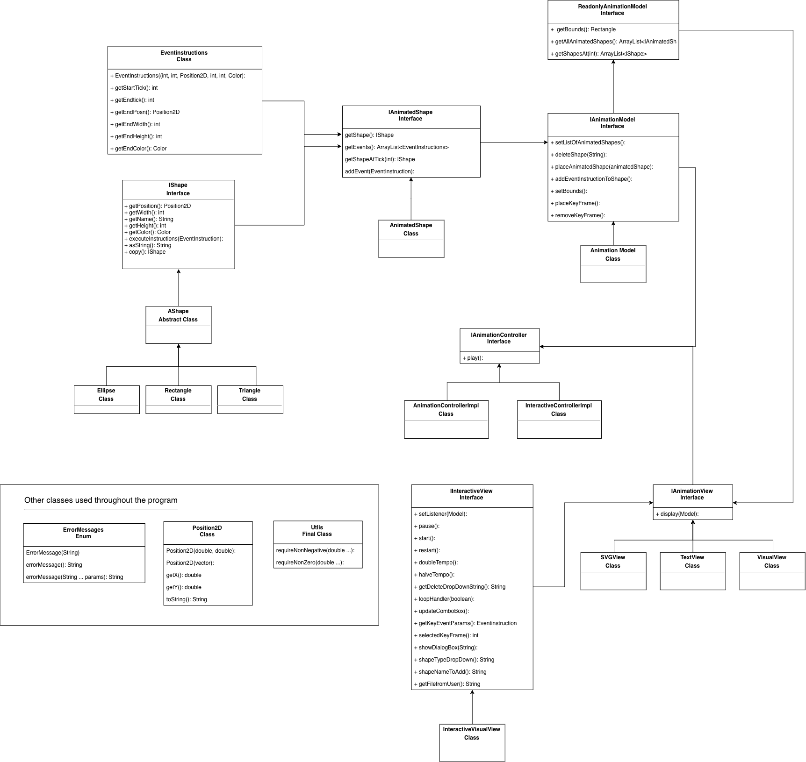

# ExCELlence Project 
Northeastern University

CS3500 - Object Oriented Design

Developers: Scott Nguyen, Justin Torre

The scope of this project is to create the four animations below using the Model-View-Controller Pattern: 
- SimpleAnimation
- Towers of Hanoi
- The Night Sky
- Big Bang and Crunch

# Brief Overview of Our Design
We used the Model View Controller pattern for this project. 
## Model - `IAnimationModel`
Responsible for carrying the data for the animation. Has the ability to add or remove key frames, shapes, etc. However, the model will never call these methods on itself, rather, the controller will delegate appropriately. Contains the list of `IAnimatedShape`'s. An animated shape contains an `IShape` as well as the shapes `EventInstructions`. 

## View - `IAnimationView`
 The view is solely responsible for displaying the data in the animation as a text description, a visual animation inside of a window, or a text compliant with SVG format. For the interactive viual view, the class implements action listener in order trigger any button events, key events, etc. The view has the ability to edit the panels within it, as well as the tempo, however, like the model, these methods will never be self called. The controller will be the one delegating to the view. 


## View - `IInteractiveView`
 This interactive view has methods that allows the controller to update and grab necessary fields within the Interactive View window. These functions allow a user to properly get the information for the actions needed when the action listener handler for the view is triggered.s


## Controller - `IAnimationController`
The controller mediates any information between the model and the view. The interactive controller implements Aciton Listener as well because it needs to be the listener for the events that occur in the view. The interactive controller has a method `actionPerformed ()` that delegates the appropriate calls to the model and view whenever a particular action event is made in the view. This delegation process is uses the Command enum to swithc through the particular commands in for the view. 

##### Avaliable Commands the controller can handle
``` java
public enum Command {
  START("Start"),
  PAUSE("Pause"),
  RESTART("Restart"),
  TEMPO_DOUBLE("Tempo x2"),
  TEMPO_HALF("Tempo /2"),
  ENABLE("Enable"),
  DISABLE("Disable"),
  DELETE_SHAPE("Delete Shape"),
  DELETE_KEYFRAME("Delete Keyframe"),
  ADD_SHAPE("Add Shape"),
  ADD_KEYFRAME("Add KeyFrame"),
  OPEN("Open"),
  SAVE("Save");
  ...
}
```



### How to Generate An Animation From Terminal/Command Prompt
1) Download `Excellence.jar` and save the text file you want to animate in the same location.
2) For Window OS, open Command Prompt. For Mac OS or Linux, open Terminal.
3) Pass in a valid command line argument.

Example of a valid command line argument using Command Prompt or Terminal:
```
java -jar NameOfJARFile.jar -in smalldemo.txt -view text -out out -speed 2
```
#
### How To Generate An Animation Using A Text File Within The Program
1) Add a text file with the animation into the project folder. 
2) Pass in valid command line arguments
    - Note: A view can be one of: "text", "visual", or "svg"

Example of a valid command line argument:
```
-in hanoi.txt -view text -out System.out 
-speed 2
```

3) Open the `Excellence` class and run the `main()` method to display to animation

### Changes to the model from Assignment 5
In the IAnimationModel, we added a method `addEventInstructionToShape()` that takes in a String "name" and a EventInstructions "e". We did this so that the model had a convenient method to get a shape by its id (the "name"), and then update the event instructions with the new event instructions e. 

We created a `setBounds` and `getBounds` methods for the model and read only model respectively. The bounds represent the bounds at which the animation will be shown. We implemented these functions for a user of the model (ie, the view) to know the possible area shapes can be represented.  

Additionally, for future support we implemented a method to add key frames into a model called `placeKeyFrame`. This function takes in the necessary parameters for a new KeyFrame within the existing events of an AnimationShape. The function does so by looking at the keyframe's time stamp and splitting up the event into two events where the end of the first event is the keyframe and the start of the second is the keyframe. These functions can be found in the Model and AnimatedShape classes.

We also created a read only interface, `ReadOnlyIAnimationModel` to make sure that the views were getting a version of the view that was immutable and can not write back to the structure. The only methods that the read only model interface has are getter methods. Our original `IAnimationModel` extends the `ReadOnlyIAnimationModel` to inherit the getter methods. 

### Changes to the model from Assignment 6
In the `IAnimationModel`, we implemented a new method `setListOfAnimatedShapes()` that sets the list of animated shapes in the model to the passed in array list of animated shapes. We needed to implement this in order for the `restart()` method in the `IInteractiveView` to be accurately implemented. The `setListOfAnimatedShapes()` method is used in the `InteractiveControllerImpl` class in order to return the list of animated shapes in the model back to its original state. 

We also implemented a method `deleteShape(String id)` that deleted a shape in the list of animated shapes based on the string id given to it. We created this method in order for the controller to have a method available to it that can delete a shape when needed. 

We had to revise how we placed keyframes into our model as well. The original implementation for adding a key fram only allowed the user to add the key frame inbetween the start and end of an `EventInstruction`. We had to allow the user to be able to add out side of the event instruction, so rather than refactoring our EventInstruction we created a code and flow that worked around our existing implementation. We did this by mocking keyframes using our eventInstruction structure. Our AnimatedShapes will contain a single key frame that is an event instruction where the start and end time are the same. Then when a new keyframe is added it simply expands that single instruction into a longer instruction. Then when we operate key frames accordingly. 


Another change we implemented in the ViewPanel where the shapes are animated on, is that we included a Looping field that allows the animation to be played back after the animation has terminated. We dynamically find the the max range on every 300th tick, to reduce latency in our animation.


